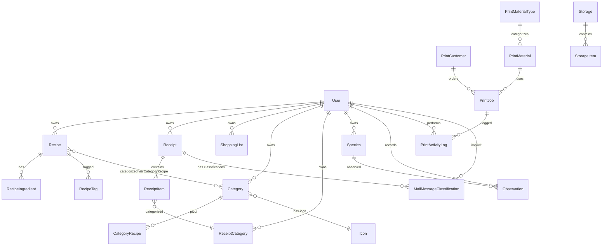

# Models & Entity-Relationship

Complete documentation of all 23 Eloquent models, their database tables, purposes, key columns, and relationships.

---

## Model Inventory

### By Domain

| Domain | Models |
|--------|--------|
| **Auth** | User |
| **Recipes** | Recipe, RecipeIngredient, RecipeTag, Category, CategoryRecipe, Icon |
| **Receipts** | Receipt, ReceiptItem, ReceiptCategory |
| **Shopping** | ShoppingList |
| **Printing** | PrintCustomer, PrintMaterial, PrintMaterialType, PrintJob, PrintSetting, PrintOrderSequence, PrintActivityLog |
| **Mail** | MailMessageClassification |
| **Species** | Species, Observation |
| **Storage** | Storage, StorageItem |

---

## Entity-Relationship Diagram

---

## Model Details

### Auth Domain

#### User
| Field | Details |
|-------|---------|
| **Table** | `users` |
| **Purpose** | Authentication and ownership for all user-scoped data |
| **Key Columns** | name, email, password (hashed), birthdate, language (enum), ip |
| **Implements** | `OAuthenticatable` (Passport) |
| **Traits** | `HasApiTokens`, `HasFactory`, `Notifiable` |
| **Relations** | (all other models reference `user_id` as foreign key) |

---

### Recipes Domain

#### Recipe
| Field | Details |
|-------|---------|
| **Table** | `recipes` |
| **Purpose** | Cooking recipe with metadata and ingredient list |
| **Key Columns** | user_id, name, description, note, public (bool), favourite (bool), timestamps, soft deletes |
| **Traits** | `HasFactory`, `SoftDeletes` |
| **Scopes** | `forAuthUser()`, `favourites()` |
| **Relations** | `categories()` → belongsToMany(Category), `ingredients()` → hasMany(RecipeIngredient), `tags()` → hasMany(RecipeTag) |
| **Methods** | `toggleFavourite()` — flips the favourite flag and saves |

#### RecipeIngredient
| Field | Details |
|-------|---------|
| **Table** | `recipe_ingredients` |
| **Purpose** | Single ingredient line in a recipe; `#` prefix = section header |
| **Key Columns** | recipe_id, name |
| **Traits** | `HasFactory` (no timestamps) |

#### RecipeTag
| Field | Details |
|-------|---------|
| **Table** | `recipe_tags` |
| **Purpose** | Free-text tag attached to a recipe |
| **Key Columns** | recipe_id, name |
| **Timestamps** | No |

#### Category
| Field | Details |
|-------|---------|
| **Table** | `categories` |
| **Purpose** | Named group for organizing recipes with an icon |
| **Key Columns** | user_id, icon_id, slug, name |
| **Traits** | `HasFactory` |
| **Scopes** | `forAuthUser()` |
| **Relations** | `user()` → belongsTo(User), `icon()` → belongsTo(Icon) |

#### CategoryRecipe
| Field | Details |
|-------|---------|
| **Table** | `category_recipe` |
| **Purpose** | Pivot linking categories to recipes with user ownership |
| **Key Columns** | user_id, recipe_id |

#### Icon
| Field | Details |
|-------|---------|
| **Table** | `icons` |
| **Purpose** | Named CSS class icon for categories |
| **Key Columns** | class, name |
| **Timestamps** | No |

---

### Receipts Domain

#### Receipt
| Field | Details |
|-------|---------|
| **Table** | `receipts` |
| **Purpose** | Purchase receipt with vendor info, file path to scan, and computed total |
| **Key Columns** | user_id, name, vendor, description, currency, date (datetime), file_path, timestamps, soft deletes |
| **Traits** | `HasFactory`, `SoftDeletes` |
| **Scopes** | `forAuthUser()` |
| **Relations** | `user()` → belongsTo(User), `items()` → hasMany(ReceiptItem) |
| **Accessors** | `getTotalAttribute()` — sums all item totals |

#### ReceiptItem
| Field | Details |
|-------|---------|
| **Table** | `receipt_items` |
| **Purpose** | Single line on a receipt |
| **Key Columns** | receipt_id, name, quantity, amount, category_id |
| **Traits** | `HasFactory` |
| **Relations** | `receipt()` → belongsTo(Receipt), `category()` → belongsTo(ReceiptCategory) |
| **Accessors** | `getTotalAttribute()` — quantity × amount |

#### ReceiptCategory
| Field | Details |
|-------|---------|
| **Table** | `receipt_categories` |
| **Purpose** | User-defined spending category with color |
| **Key Columns** | user_id, name, color |
| **Traits** | `HasFactory` |
| **Relations** | `user()` → belongsTo(User), `items()` → hasMany(ReceiptItem) |

---

### Shopping Domain

#### ShoppingList
| Field | Details |
|-------|---------|
| **Table** | `shopping_list` |
| **Purpose** | A shopping list item with ordering and check state |
| **Key Columns** | user_id, name, order (int), status (active/checked), timestamps, soft deletes |
| **Traits** | `SoftDeletes` |
| **Scopes** | `forAuthUser()` |
| **Methods** | `isSectionHeader()` — true if name starts with `#` |

---

### 3D Printing Domain

#### PrintCustomer
| Field | Details |
|-------|---------|
| **Table** | `print_customers` |
| **Purpose** | Client who orders 3D printed items |
| **Key Columns** | name, email, phone, notes, timestamps, soft deletes |
| **Traits** | `HasFactory`, `SoftDeletes` |
| **Scopes** | `active()` |
| **Relations** | `printJobs()` → hasMany(PrintJob) |

#### PrintMaterialType
| Field | Details |
|-------|---------|
| **Table** | `print_material_types` |
| **Purpose** | Category of material (e.g., "PLA", "PETG") with power consumption rate |
| **Key Columns** | name, avg_kwh_per_hour |
| **Traits** | `HasFactory` |
| **Relations** | `materials()` → hasMany(PrintMaterial) |

#### PrintMaterial
| Field | Details |
|-------|---------|
| **Table** | `print_materials` |
| **Purpose** | Specific material variant with pricing |
| **Key Columns** | material_type_id, name, price_per_kg_dkk (float), waste_factor_pct (float), notes, timestamps, soft deletes |
| **Traits** | `HasFactory`, `SoftDeletes` |
| **Scopes** | `active()` |
| **Relations** | `materialType()` → belongsTo(PrintMaterialType), `printJobs()` → hasMany(PrintJob) |

#### PrintJob
| Field | Details |
|-------|---------|
| **Table** | `print_jobs` |
| **Purpose** | A print order with job parameters and pricing calculation |
| **Key Columns** | order_no, date, description, internal_notes, customer_id, material_id, pieces_per_plate, plates, grams_per_plate (float), hours_per_plate (float), labor_hours (float), is_first_time_order (bool), avance_pct_override (float), status (draft/locked), locked_at (datetime), calc_snapshot (JSON array), timestamps, soft deletes |
| **Traits** | `HasFactory`, `SoftDeletes` |
| **Scopes** | `draft()`, `locked()`, `active()` |
| **Relations** | `customer()` → belongsTo(PrintCustomer), `material()` → belongsTo(PrintMaterial), `activityLogs()` → hasMany(PrintActivityLog) |
| **Methods** | `isDraft()`, `isLocked()`, `buildSnapshot()`, `lock()` |

#### PrintSetting
| Field | Details |
|-------|---------|
| **Table** | `print_settings` |
| **Purpose** | Singleton (id=1) global pricing settings with 1h cache |
| **Key Columns** | id, electricity_rate_dkk_per_kwh, wage_rate_dkk_per_hour, default_avance_pct, first_time_fee_dkk |
| **Traits** | `HasFactory` |
| **Static Methods** | `current()` — cached get-or-create, `clearCache()` |
| **Hook** | `saved`/`deleted` events clear cache |

#### PrintOrderSequence
| Field | Details |
|-------|---------|
| **Table** | `print_order_sequences` |
| **Purpose** | Auto-incrementing order number per year (YYYY-NNN) |
| **Key Columns** | year, last_number |
| **Traits** | `HasFactory` (no timestamps) |
| **Static Methods** | `getOrCreateForYear(int $year)` — firstOrCreate pattern |

#### PrintActivityLog
| Field | Details |
|-------|---------|
| **Table** | `print_activity_log` |
| **Purpose** | Audit trail of actions on print jobs |
| **Key Columns** | print_job_id, action (string), user_id, metadata (JSON array) |
| **Traits** | `HasFactory` |
| **Relations** | `printJob()` → belongsTo(PrintJob), `user()` → belongsTo(User) |

---

### Mail Domain

#### MailMessageClassification
| Field | Details |
|-------|---------|
| **Table** | `mail_message_classifications` |
| **Purpose** | Records the result of classifying an email as receipt/payslip/unknown |
| **Key Columns** | fastmail_email_id, document_type (enum: receipt/payslip/unknown), confidence (float), source (enum: metadata/mobilepay/attachment_text/n8n/manual), classified_at (datetime), receipt_id, processed_at (datetime) |
| **Relations** | `receipt()` → belongsTo(Receipt) |

---

### Bird Species Domain

#### Species
| Field | Details |
|-------|---------|
| **Table** | `species` |
| **Purpose** | Bird species record with Danish common name |
| **Key Columns** | common_name, scientific_name, ebird_code, taxonomic_order, user_id |
| **Traits** | `HasFactory` |
| **Relations** | `user()` → belongsTo(User), `observations()` → hasMany(Observation) ordered by observed_at desc |

#### Observation
| Field | Details |
|-------|---------|
| **Table** | `observations` |
| **Purpose** | A bird sighting record with eBird and Merlin metadata |
| **Key Columns** | species_id, user_id, observed_at (date), observed_time, count, location, state_province, ebird_submission_id (unique), observation_type, duration_min, distance_km (float), area_ha (float), observer_count, complete_checklist (bool), source |
| **Traits** | `HasFactory` |
| **Relations** | `species()` → belongsTo(Species), `user()` → belongsTo(User) |

---

### Storage Domain

#### Storage
| Field | Details |
|-------|---------|
| **Table** | `storage` |
| **Purpose** | Named physical storage location |
| **Key Columns** | name |
| **Relations** | `items()` → hasMany(StorageItem) ordered by sort_order |

#### StorageItem
| Field | Details |
|-------|---------|
| **Table** | `storage_items` |
| **Purpose** | Item stored at a location |
| **Key Columns** | storage_id, name, quantity, sort_order |
| **Relations** | `storage()` → belongsTo(Storage) |

---

## Key Relationships Summary

### One-to-Many

| Parent | Child | Foreign Key |
|--------|-------|-------------|
| User | Recipe | user_id |
| User | Receipt | user_id |
| User | ShoppingList | user_id |
| User | Category | user_id |
| User | ReceiptCategory | user_id |
| User | Species | user_id |
| User | Observation | user_id |
| Recipe | RecipeIngredient | recipe_id |
| Recipe | RecipeTag | recipe_id |
| Receipt | ReceiptItem | receipt_id |
| PrintCustomer | PrintJob | customer_id |
| PrintMaterial | PrintJob | material_id |
| PrintMaterialType | PrintMaterial | material_type_id |
| PrintJob | PrintActivityLog | print_job_id |
| Species | Observation | species_id |
| Storage | StorageItem | storage_id |
| ReceiptCategory | ReceiptItem | category_id |

### Many-to-Many

| Left | Right | Pivot Table | Additional Fields |
|------|-------|-------------|-------------------|
| Recipe | Category | category_recipe | user_id |

### Belongs To (with nullable)

| Child | Parent | Nullable? |
|-------|--------|-----------|
| ReceiptItem | ReceiptCategory | Yes (category_id nullable) |
| MailMessageClassification | Receipt | Yes (receipt_id nullable) |
| Category | Icon | Yes (icon_id nullable) |

---

## Polymorphic Relationships

Dyhrene currently uses **no polymorphic relationships**. All relationships are explicit foreign keys to specific models. This keeps the schema simple and enables PHPStan's Eloquent generics to work without ambiguity.

---

## Model Conventions

### Required for Every Model

1. `declare(strict_types=1);`
2. `$fillable` array listing mass-assignable columns
3. `$casts` array for type casting (booleans, datetimes, floats, enums, arrays/JSON)
4. `HasFactory` trait with PHPDoc generic: `/** @use HasFactory<\Database\Factories\{Model}Factory> */` — strongly recommended for all new models, though some legacy models (ShoppingList, Storage, StorageItem, CategoryRecipe, Icon, MailMessageClassification) do not yet have it
5. PHPDoc generics on all relation methods and query scopes
6. `SoftDeletes` trait if the table has `deleted_at`
7. `$timestamps = false` if the table does not have `created_at`/`updated_at`

### What Models Should NOT Contain

- Business logic (use Actions or Domain services)
- HTTP concerns (use Livewire components or Controllers)
- Validation rules (use FormRequest or Livewire `$this->validate()`)
- Complex queries (use scopes)
- Direct `DB::` calls (use `Model::query()`)
