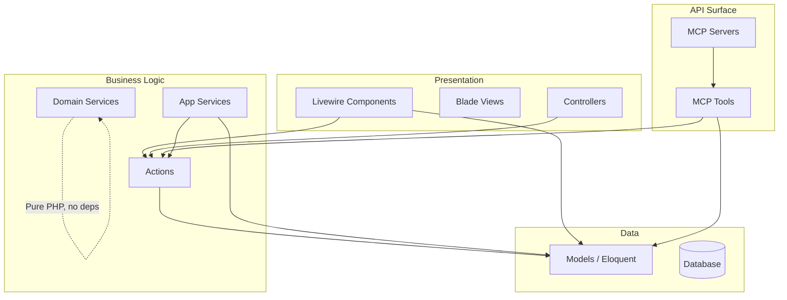
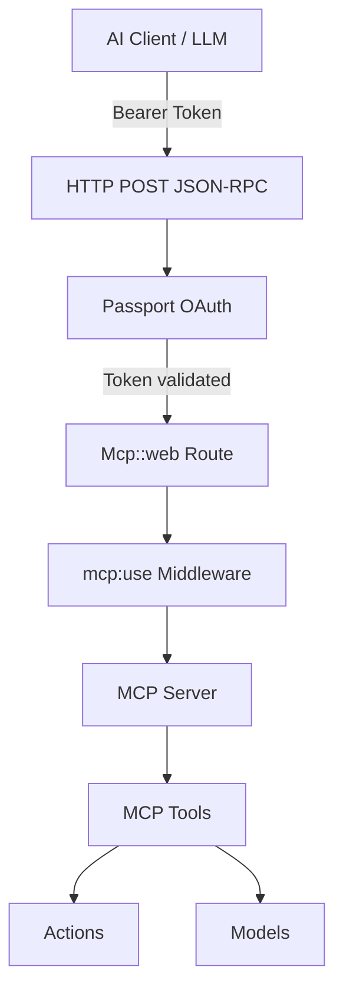
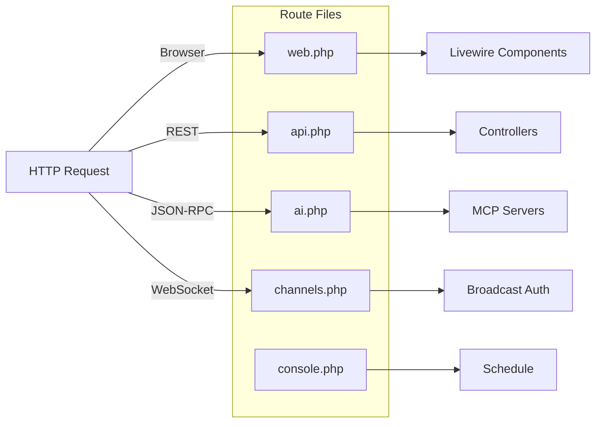

# Architecture

Deep-dive into the Dyhrene application's architecture — layers, domains, patterns, auth, events, and route design.

---

## Layered Architecture

Dyhrene follows a **layered architecture** where each layer has clear responsibilities and dependencies flow inward:



### Layer Responsibilities

| Layer | Directory | Responsibility |
|-------|-----------|----------------|
| **Presentation** | `app/Livewire/`, `resources/views/` | UI rendering, input validation, user interaction |
| **Business Logic** | `app/Actions/`, `app/Domain/`, `app/Services/` | Business rules, workflows, calculations |
| **API Surface** | `app/Mcp/` | MCP servers & tools for AI client access |
| **Data** | `app/Models/` | Eloquent ORM, query scopes, relationships |

## Domain-Driven Design Elements

While not strictly DDD, Dyhrene borrows several DDD patterns:

### app/Domain/ — Pure Domain Services

Classes in `app/Domain/` are framework-agnostic. They:
- Accept **only primitives or arrays/DTOs** as input
- Return **only primitives or arrays**
- Contain **zero** Eloquent, HTTP, or facade dependencies
- Are trivially unit-testable because they have no side effects

**Example: `PrintJobCalculator`**

```php
// app/Domain/Printing/PrintJobCalculator.php
final class PrintJobCalculator
{
    public function calculate(array $input): array
    {
        $totals = $this->calculateTotals($input);
        $costs = $this->calculateCosts($input, $totals);
        $pricing = $this->calculatePricing($input, $costs, $totals);
        $profit = $this->calculateProfit($costs, $pricing, $totals);

        return ['totals' => $totals, 'costs' => $costs,
                'pricing' => $pricing, 'profit' => $profit];
    }
}
```

This service can be called from Livewire, MCP tools, CLI commands, or tests — all with the same interface.

### app/Actions/ — Single-Purpose Operations

Actions bridge the gap between domain services and the framework. They orchestrate Eloquent operations:

```php
class CreateReceiptAction
{
    public function handle(User $user, ?array $data): Receipt
    {
        $data['user_id'] = $user->id;
        return Receipt::query()->create($data);
    }
}
```

### app/Services/ — Multi-Step Business Logic

Services handle cross-cutting concerns that span multiple models or external integrations:

| Service | Purpose |
|---------|---------|
| `Services/Fastmail/` | JMAP client for email, mailbox, identity, session management |
| `Services/Receipts/` | Receipt extraction pipeline: file prep, N8n extraction, data mapping |
| `Services/Mail/` | Classification pipeline: metadata → MobilePay → attachment-text → N8n |
| `Services/Ebird/` | eBird CSV import and Merlin checklist enrichment |

## MCP Architecture

The MCP (Model Context Protocol) surface allows AI clients to interact with Dyhrene data through typed tools.

### Architecture Overview



### Key Components

| Component | Location | Purpose |
|-----------|----------|---------|
| **Server** | `app/Mcp/Servers/` | Registers tools, declares name/version/instructions |
| **Tools** | `app/Mcp/Tools/{Domain}/` | Individual tool implementations with typed parameters |
| **Route Files** | `app/Mcp/{Domain}/{Domain}McpRoute.php` | Define MCP HTTP path constants |
| **Registry** | `app/Mcp/McpServerRegistry.php` | Declarative list for settings UI |
| **Notifier** | `app/Mcp/ShoppingList/ShoppingListMcpNotifier.php` | Real-time broadcast on shopping list changes |

### Server Registration

Servers are registered in three places:
1. **Route** (`routes/ai.php`): `Mcp::web(Path::PATH, ServerClass::class)->middleware(...)`
2. **Registry** (`app/Mcp/McpServerRegistry.php`): Declarative `servers()` array for the settings UI
3. **Server class**: Lists available tools in `protected array $tools`

### Authentication Flow

```
1. Client obtains an OAuth 2.1 access token from the Passport token endpoint
2. Token must include the `mcp:use` scope
3. Token sent as Bearer token in HTTP Authorization header
4. `auth:api` middleware authenticates the user
5. `CheckToken::using('mcp:use')` validates the scope
6. Tools execute in the context of the authenticated user
```

## Auth Layers

Dyhrene uses a **dual auth system**:

| Auth Guard | Provider | Purpose | Scope |
|------------|----------|---------|-------|
| **web** (Sanctum) | Session-based | Browser UI, Livewire components | All web routes |
| **api** (Passport) | OAuth 2.1 tokens | MCP servers, REST API | `mcp:use` scope required for MCP |

Both guards share the same `User` model (the `users` table). The User model implements `OAuthenticatable` for Passport.

```php
class User extends Authenticatable implements OAuthenticatable
{
    use HasApiTokens;  // Passport tokens
    use HasFactory;
    use Notifiable;
}
```

### Route-Level Auth

```php
// Web routes — session-based
Route::get('/', Recipes::class)->middleware('auth')->name('index');

// MCP routes — token-based with scope check
Mcp::web(ReceiptsMcpRoute::PATH, ReceiptServer::class)
    ->middleware(['auth:api', CheckToken::using('mcp:use')]);
```

## Event System

### Broadcasting (Reverb)

Real-time features use Laravel's broadcasting system with Reverb as the WebSocket server:

```php
// Broadcasting channel authorization (routes/channels.php)
Broadcast::channel('user.{id}', function (User $user, int $id): bool {
    return $user->id === $id;
});
```

Client-side, `laravel-echo` + `pusher-js` connect to Reverb. The Reverb connection settings are exposed on `window.Laravel` via Blade (not Vite env vars):

```javascript
// resources/js/echo.js
import Echo from 'laravel-echo';

import Pusher from 'pusher-js';
window.Pusher = Pusher;

window.Echo = new Echo({
    broadcaster: 'reverb',
    key: window.Laravel.reverbKey,
    wsHost: window.Laravel.reverbHost,
    wsPort: window.Laravel.reverbPort ?? 80,
    wssPort: window.Laravel.reverbPort ?? 443,
    forceTLS: (window.Laravel.reverbScheme ?? 'https') === 'https',
    enabledTransports: ['ws', 'wss'],
});
```

### Shopping List Events

When items are changed via MCP tools, `ShoppingListMcpNotifier` broadcasts events to the owning user's channel, ensuring the Livewire UI updates in real-time.

## Service Layer Patterns

### Fastmail (JMAP)

A complete JMAP client implementation:

```
app/Services/Fastmail/
├── FastmailJmapClient.php       # HTTP client for JMAP requests
├── FastmailSession.php          # Session management
├── FastmailEmailService.php     # Email operations
├── FastmailMailboxService.php   # Mailbox operations
├── FastmailIdentityService.php  # Identity management
├── EmailQuery.php               # Query builder for email searches
├── DTOs/                        # Data transfer objects
│   ├── EmailMessage.php
│   ├── EmailSummary.php
│   ├── EmailAttachment.php
│   ├── EmailIdentity.php
│   ├── EmailQueryResult.php
│   └── Mailbox.php
├── Exceptions/                  # Custom exceptions
│   ├── FastmailApiException.php
│   └── FastmailConfigurationException.php
└── Support/
    └── JmapCasts.php            # Type casting helpers
```

### Mail Classification Pipeline

```
app/Services/Mail/
├── MailDocumentClassificationService.php    # Orchestrator
├── MetadataMailDocumentClassifier.php       # Classifier 1: email metadata
├── MobilePayMailDocumentClassifier.php      # Classifier 2: MobilePay patterns
├── AttachmentTextMailDocumentClassifier.php # Classifier 3: attachment text
├── N8nMailDocumentClassifier.php            # Classifier 4: N8n workflow
├── MailDocumentKeywordScorer.php            # Keyword scoring
├── MailAttachmentTextExtractor.php          # Attachment text extraction
├── MailReceiptImportService.php             # Import classified receipts
├── ClassifiableMailAttachment.php           # Attachment wrapper
├── DTOs/
│   └── MailDocumentClassificationResult.php
```

The pipeline is sequential: each classifier runs only if the previous one is inconclusive.

### Receipt Processing

```
app/Services/Receipts/
├── ReceiptExtractionFilePreparer.php   # Preprocess receipt files
├── N8nReceiptExtractor.php             # N8n-based OCR extraction
├── ReceiptExtractedDataMapper.php      # Map extracted data to models
├── ReceiptAttachmentStorage.php        # Store receipt files on Wasabi
├── ReceiptMailBodyImageRenderer.php    # Render email body images
├── DTOs/
│   └── MappedReceiptData.php
└── Exceptions/
    └── ReceiptExtractionException.php
```

### eBird Integration

```
app/Services/Ebird/
└── EbirdImportService.php  # Login, fetch species codes, download CSVs,
                             # create Species/Observation records, enrich from Merlin
```

## Route Surface Design



### routes/web.php

All browser routes mount Livewire components. Each route specifies the Livewire class directly:

```php
Route::get('/', Recipes::class)->middleware('auth')->name('index');
Route::get('/recipe/{id}', SingleRecipe::class)->middleware('auth')->name('single');
Route::get('shopping/list', ShoppingList::class)->middleware('auth')->name('shopping.list');
Route::get('/printing', Printing\Index::class)->middleware('auth')->name('printing.index');
```

**Complete route index:**

| Path | Livewire Component | Purpose |
|------|-------------------|---------|
| `/` | `Recipes` | Recipe listing (index) |
| `/login` | `Login` | Authentication |
| `/logout` | (closure) | Logout → redirect |
| `/recipe/add` | `AddRecipe` | Create recipe |
| `/recipe/search` | `SearchRecipe` | Search recipes |
| `/recipe/{id}` | `SingleRecipe` | View recipe |
| `/recipe/{id}/edit` | `EditRecipe` | Edit recipe |
| `/category/{slug}` | `Categories` | Category listing |
| `/tag/{tag}` | `Tags` | Tag listing |
| `/shopping/list` | `Shopping\ShoppingList` | Shopping list |
| `/settings/categories` | `Settings\Categories` | Category management |
| `/settings/mcp` | `Settings\McpConnection` | MCP connection info |
| `/storage` | `Storage` | Storage locations & items |
| `/mail` | `Mail\Inbox` | Fastmail inbox |
| `/receipts` | `Receipts\Index` | Receipt listing |
| `/receipts/create` | `Receipts\Create` | Upload receipt |
| `/receipts/mass-edit-items` | `Receipts\MassEditItems` | Batch edit items |
| `/receipts/{receipt}` | `Receipts\Show` | View receipt |
| `/receipts/{receipt}/edit` | `Receipts\Edit` | Edit receipt |
| `/receipts/image/{receipt}` | (closure) | Serve receipt image |
| `/species` | `Species\SpeciesIndex` | Species listing |
| `/species/add` | `Species\AddObservation` | Add observation |
| `/species/add/{species}` | `Species\AddObservation` | Add observation (species preselected) |
| `/species/{species}` | `Species\SpeciesShow` | View species |
| `/printing` | `Printing\Index` | Print dashboard |
| `/print-customers` | `PrintCustomers\Index` | Customer list |
| `/print-customers/create` | `PrintCustomers\Create` | New customer |
| `POST /print-customers` | `PrintCustomers\Create::save` | Store customer |
| `/print-customers/{customer}/edit` | `PrintCustomers\Edit` | Edit customer |
| `PUT /print-customers/{customer}` | `PrintCustomers\Edit::save` | Update customer |
| `DELETE /print-customers/{customer}` | `PrintCustomers\Index::delete` | Delete customer |
| `/print-material-types` | `PrintMaterialTypes\Index` | Material type list |
| `/print-material-types/create` | `PrintMaterialTypes\Create` | New material type |
| `POST /print-material-types` | `PrintMaterialTypes\Create::save` | Store material type |
| `/print-material-types/{materialType}/edit` | `PrintMaterialTypes\Edit` | Edit material type |
| `PUT /print-material-types/{materialType}` | `PrintMaterialTypes\Edit::save` | Update material type |
| `DELETE /print-material-types/{materialType}` | `PrintMaterialTypes\Index::delete` | Delete material type |
| `/print-materials` | `PrintMaterials\Index` | Material list |
| `/print-materials/create` | `PrintMaterials\Create` | New material |
| `POST /print-materials` | `PrintMaterials\Create::save` | Store material |
| `/print-materials/{material}/edit` | `PrintMaterials\Edit` | Edit material |
| `PUT /print-materials/{material}` | `PrintMaterials\Edit::save` | Update material |
| `DELETE /print-materials/{material}` | `PrintMaterials\Index::delete` | Delete material |
| `/print-settings` | `PrintSettings\Edit` | Global print settings |
| `PUT /print-settings` | `PrintSettings\Edit::save` | Update print settings |
| `/print-jobs` | `PrintJobs\Index` | Print job list |
| `/print-jobs/create` | `PrintJobs\Create` | New print job |
| `POST /print-jobs` | `PrintJobs\Create::save` | Store print job |
| `/print-jobs/{printJob}` | `PrintJobs\Show` | View print job |
| `/print-jobs/{printJob}/edit` | `PrintJobs\Edit` | Edit print job |
| `PUT /print-jobs/{printJob}` | `PrintJobs\Edit::save` | Update print job |
| `DELETE /print-jobs/{printJob}` | `PrintJobs\Index::delete` | Delete print job |

Routes without an explicit HTTP verb are `GET`.

### routes/api.php

Currently empty — REST is rarely used in this Livewire-first architecture.

### routes/ai.php

MCP server routes:

```php
Mcp::oauthRoutes();  // OAuth discovery endpoints

Mcp::web(ShoppingListMcpRoute::PATH, ShoppingListServer::class)
    ->middleware(['auth:api', CheckToken::using('mcp:use')]);

Mcp::web(ReceiptsMcpRoute::PATH, ReceiptServer::class)
    ->middleware(['auth:api', CheckToken::using('mcp:use')]);

Mcp::web(RecipesMcpRoute::PATH, RecipeServer::class)
    ->middleware(['auth:api', CheckToken::using('mcp:use')]);
```

Each server lives at a sub-path under `/mcp/`:
- `/mcp/shopping-list` — Shopping List Server
- `/mcp/receipts` — Receipts Server
- `/mcp/recipes` — Recipes Server

### routes/channels.php

Reverb broadcast channel authorization:

```php
Broadcast::channel('App.Models.User.{id}', fn(User $user, int $id) => $user->id === $id);
Broadcast::channel('user.{id}', fn(User $user, int $id) => $user->id === $id);
```

### routes/console.php

Artisan schedule definitions:

```php
Schedule::command('ebird:import')->dailyAt('06:00');
```

## Complete Directory Structure

```
app/
├── Actions/
│   ├── CreateReceiptAction.php
│   ├── UpdateReceiptAction.php
│   └── DeleteReceiptAction.php
│
├── Console/
│   └── Commands/
│       ├── ImportEbirdObservationsCommand.php   (ebird:import)
│       ├── ClassifyMailCommand.php               (mail:classify)
│       └── ImportMailReceiptsCommand.php         (mail:import-receipts)
│
├── Domain/
│   └── Printing/
│       └── PrintJobCalculator.php                (pure pricing logic)
│
├── Enums/
│   ├── LanguageEnum.php
│   ├── MailClassificationSourceEnum.php
│   ├── MailDocumentTypeEnum.php
│   └── Concerns/                                (shared enum traits)
│
├── Events/                                       (broadcast events)
│
├── Exceptions/
│   └── Handler.php                               (exception handler)
│
├── Http/
│   ├── Controllers/                              (empty — Livewire-first)
│   ├── Middleware/
│   └── Requests/
│       ├── CreateReceiptRequest.php
│       └── UpdateReceiptRequest.php
│
├── Livewire/
│   ├── AddRecipe.php
│   ├── EditRecipe.php
│   ├── Login.php
│   ├── Recipes.php
│   ├── SearchRecipe.php
│   ├── SingleRecipe.php
│   ├── Storage.php
│   ├── Category/
│   │   └── Categories.php
│   ├── Tag/
│   │   └── Tags.php
│   ├── Settings/
│   │   ├── Categories.php
│   │   ├── Edit.php
│   │   └── McpConnection.php
│   ├── Receipts/
│   │   ├── Create.php
│   │   ├── Edit.php
│   │   ├── Index.php
│   │   ├── MassEditItems.php
│   │   └── Show.php
│   ├── Mail/
│   │   └── Inbox.php
│   ├── Shopping/
│   │   └── ShoppingList.php
│   ├── Species/
│   │   ├── AddObservation.php
│   │   ├── SpeciesIndex.php
│   │   └── SpeciesShow.php
│   ├── Printing/
│   │   └── Index.php
│   ├── PrintCustomers/
│   │   ├── Create.php
│   │   ├── Edit.php
│   │   └── Index.php
│   ├── PrintMaterialTypes/
│   │   ├── Create.php
│   │   ├── Edit.php
│   │   └── Index.php
│   ├── PrintMaterials/
│   │   ├── Create.php
│   │   ├── Edit.php
│   │   └── Index.php
│   ├── PrintSettings/
│   │   └── Edit.php
│   └── PrintJobs/
│       ├── Create.php
│       ├── Edit.php
│       ├── Index.php
│       └── Show.php
│
├── Mcp/
│   ├── McpServerRegistry.php
│   ├── Servers/
│   │   ├── ReceiptServer.php
│   │   ├── RecipeServer.php
│   │   └── ShoppingListServer.php
│   ├── Tools/
│   │   ├── Receipts/
│   │   │   ├── ListReceiptsTool.php
│   │   │   ├── CreateReceiptTool.php
│   │   │   ├── UpdateReceiptTool.php
│   │   │   ├── UpdateReceiptItemsTool.php
│   │   │   ├── GetReceiptItemsTool.php
│   │   │   ├── GetReceiptItemsBatchTool.php
│   │   │   ├── GetReceiptImageTool.php
│   │   │   └── ListReceiptCategoriesTool.php
│   │   ├── Recipes/
│   │   │   ├── ListRecipesTool.php
│   │   │   ├── CreateRecipeTool.php
│   │   │   ├── GetRecipeTool.php
│   │   │   ├── UpdateRecipeTool.php
│   │   │   ├── DeleteRecipeTool.php
│   │   │   ├── SearchRecipesTool.php
│   │   │   ├── ListRecipeCategoriesTool.php
│   │   │   ├── ListRecipeTagsTool.php
│   │   │   └── RecipeToolSupport.php
│   │   └── ShoppingList/
│   │       ├── ListShoppingListItemsTool.php
│   │       ├── AddShoppingListItemTool.php
│   │       ├── RemoveShoppingListItemTool.php
│   │       ├── CheckShoppingListItemTool.php
│   │       ├── UncheckShoppingListItemTool.php
│   │       └── ReorderShoppingListItemsTool.php
│   ├── Receipts/
│   │   ├── ReceiptsMcpRoute.php
│   │   ├── ReceiptMcpItemPayload.php
│   │   └── ReceiptMcpImageStorage.php
│   ├── Recipes/
│   │   └── RecipesMcpRoute.php
│   └── ShoppingList/
│       ├── ShoppingListMcpRoute.php
│       └── ShoppingListMcpNotifier.php
│
├── Models/
│   ├── User.php
│   ├── Recipe.php
│   ├── RecipeIngredient.php
│   ├── RecipeTag.php
│   ├── Category.php
│   ├── CategoryRecipe.php
│   ├── Icon.php
│   ├── Receipt.php
│   ├── ReceiptItem.php
│   ├── ReceiptCategory.php
│   ├── ShoppingList.php
│   ├── PrintCustomer.php
│   ├── PrintMaterial.php
│   ├── PrintMaterialType.php
│   ├── PrintJob.php
│   ├── PrintSetting.php
│   ├── PrintOrderSequence.php
│   ├── PrintActivityLog.php
│   ├── MailMessageClassification.php
│   ├── Species.php
│   ├── Observation.php
│   ├── Storage.php
│   └── StorageItem.php
│
├── Providers/
│   ├── AppServiceProvider.php
│   ├── AuthServiceProvider.php
│   ├── BroadcastServiceProvider.php
│   ├── EventServiceProvider.php
│   └── RouteServiceProvider.php
│
├── Services/
│   ├── Ebird/
│   │   └── EbirdImportService.php
│   ├── Fastmail/
│   │   ├── FastmailJmapClient.php
│   │   ├── FastmailSession.php
│   │   ├── FastmailEmailService.php
│   │   ├── FastmailMailboxService.php
│   │   ├── FastmailIdentityService.php
│   │   ├── EmailQuery.php
│   │   ├── DTOs/
│   │   ├── Exceptions/
│   │   └── Support/
│   ├── Mail/
│   │   ├── MailDocumentClassificationService.php
│   │   ├── MetadataMailDocumentClassifier.php
│   │   ├── MobilePayMailDocumentClassifier.php
│   │   ├── AttachmentTextMailDocumentClassifier.php
│   │   ├── N8nMailDocumentClassifier.php
│   │   ├── MailDocumentKeywordScorer.php
│   │   ├── MailAttachmentTextExtractor.php
│   │   ├── MailReceiptImportService.php
│   │   ├── ClassifiableMailAttachment.php
│   │   └── DTOs/
│   └── Receipts/
│       ├── ReceiptExtractionFilePreparer.php
│       ├── N8nReceiptExtractor.php
│       ├── ReceiptExtractedDataMapper.php
│       ├── ReceiptAttachmentStorage.php
│       ├── ReceiptMailBodyImageRenderer.php
│       ├── DTOs/
│       └── Exceptions/
│
└── Support/
    ├── Format.php
    └── ReceiptDuplicateGuard.php
```
