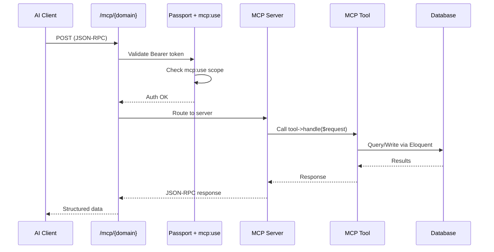

# MCP Integration

A deep-dive into the Model Context Protocol (MCP) integration — how AI clients access Dyhrene data through typed tools.

---

## What is MCP?

The **Model Context Protocol (MCP)** is an open standard that allows AI clients (LLMs like Claude, ChatGPT, etc.) to interact with external tools and data sources in a structured, typed way. Dyhrene uses `laravel/mcp` to expose its core data as MCP servers.

### Why MCP?

| Benefit | Description |
|---------|-------------|
| **Typed Interface** | Every tool has declared parameter types and return schemas — AI clients don't guess |
| **Standard Protocol** | JSON-RPC over HTTP POST — works with any MCP-compatible client |
| **Fine-grained Auth** | OAuth 2.1 scopes control exactly what AI clients can access |
| **Real-time** | Shopping list changes via MCP broadcast to Livewire UI instantly |
| **Domain-separated** | Each domain (recipes, receipts, shopping) is its own server |

## Architecture



## Server Registration

Adding a new MCP server involves four coordinated steps:

### 1. Create the Server Class

Extend `Laravel\Mcp\Server` with PHP 8 attributes for metadata:

```php
#[Name(value: 'Receipts Server')]
#[Version(value: '0.1.0')]
#[Instructions(value: <<<'MARKDOWN'
This server manages the signed-in user's receipts...
MARKDOWN)]
class ReceiptServer extends Server
{
    protected array $tools = [
        ListReceiptsTool::class,
        CreateReceiptTool::class,
        // ...
    ];

    protected array $resources = [
    ];

    protected array $prompts = [
    ];
}
```

The `#[Instructions]` attribute serves as the system prompt for AI clients — it describes available tools and how to use them.

### 2. Create Tool Classes

Each tool extends `Laravel\Mcp\Server\Tool`. Class-level attributes (`#[Name]`, `#[Description]`, `#[IsReadOnly]`) provide metadata, the `schema()` method declares parameters, and `handle()` performs the work:

```php
use Illuminate\Contracts\JsonSchema\JsonSchema;
use Laravel\Mcp\Request;
use Laravel\Mcp\Response;
use Laravel\Mcp\Server\Attributes\Description;
use Laravel\Mcp\Server\Attributes\Name;
use Laravel\Mcp\Server\Tool;
use Laravel\Mcp\Server\Tools\Annotations\IsReadOnly;

#[Name(value: 'receipt_list')]
#[Description(value: 'List receipts for the authenticated user. Optional from/to YYYY-MM-DD inclusive filter on receipt date.')]
#[IsReadOnly(value: true)]
class ListReceiptsTool extends Tool
{
    public function handle(Request $request): Response
    {
        /** @var array{from?: string, to?: string} $validated */
        $validated = $request->validate([
            'from' => 'nullable|date_format:Y-m-d',
            'to' => 'nullable|date_format:Y-m-d',
        ]);

        $query = Receipt::forAuthUser()->orderByDesc('date');

        if (isset($validated['from'])) {
            $query->where('date', '>=', $validated['from']);
        }

        if (isset($validated['to'])) {
            $query->where('date', '<=', $validated['to']);
        }

        return Response::structured(['receipts' => $query->get()->toArray()]);
    }

    /**
     * @return array<string, mixed>
     */
    public function schema(JsonSchema $schema): array
    {
        return [
            'from' => $schema->string()->description('Optional start date (YYYY-MM-DD), inclusive.'),
            'to' => $schema->string()->description('Optional end date (YYYY-MM-DD), inclusive.'),
        ];
    }
}
```

### 3. Define Route File

Create a route support class with a `PATH` constant:

```php
// app/Mcp/Receipts/ReceiptsMcpRoute.php
final class ReceiptsMcpRoute
{
    public const string PATH = 'mcp/receipts';
}
```

### 4. Wire the Route

In `routes/ai.php`:

```php
Mcp::web(ReceiptsMcpRoute::PATH, ReceiptServer::class)
    ->middleware(['auth:api', CheckToken::using('mcp:use')]);
```

### 5. Register in McpServerRegistry

In `app/Mcp/McpServerRegistry.php`:

```php
[
    'id' => 'receipts',
    'title' => 'Receipts',
    'description' => 'AI clients can list receipts, fetch line items...',
    'path' => ReceiptsMcpRoute::PATH,
],
```

This feeds the **MCP & OAuth (AI assistants)** settings UI.

## Authentication Flow

### Obtaining a Token

```bash
# 1. Register an OAuth client
curl -X POST https://dyhrene.example.com/oauth/register \
  -H "Content-Type: application/json" \
  -d '{"client_name": "My AI Agent", "redirect_uris": ["http://localhost:8080/callback"]}'

# 2. Get authorization code (user visits in browser)
# https://dyhrene.example.com/oauth/authorize?client_id=...&scope=mcp:use&response_type=code

# 3. Exchange code for access token
curl -X POST https://dyhrene.example.com/oauth/token \
  -H "Content-Type: application/json" \
  -d '{"grant_type": "authorization_code", "client_id": "...",
       "client_secret": "...", "code": "..."}'

# 4. Use token in MCP requests
curl -X POST https://dyhrene.example.com/mcp/receipts \
  -H "Authorization: Bearer YOUR_ACCESS_TOKEN" \
  -H "Content-Type: application/json" \
  -d '{"jsonrpc": "2.0", "method": "tools/call",
       "params": {"name": "receipt_list", "arguments": {}}, "id": 1}'
```

### Scope Requirement

The `mcp:use` scope is **required** for all MCP endpoints. Without it, the `CheckToken::using('mcp:use')` middleware rejects the request with a 403.

### Endpoint Discovery

- **OAuth metadata:** `GET /mcp/oauth/authorization-server`
- **Protected resource metadata:** `GET /mcp/oauth/protected-resource/{path}`
- **Dynamic client registration:** `POST /oauth/register`
- **Token endpoint:** `POST /oauth/token`

## Route Wiring

`routes/ai.php` is the single file where all MCP servers are wired:

```php
Mcp::oauthRoutes();  // OAuth discovery endpoints (automatically generated)

Mcp::web(ShoppingListMcpRoute::PATH, ShoppingListServer::class)
    ->middleware(['auth:api', CheckToken::using('mcp:use')]);

Mcp::web(ReceiptsMcpRoute::PATH, ReceiptServer::class)
    ->middleware(['auth:api', CheckToken::using('mcp:use')]);

Mcp::web(RecipesMcpRoute::PATH, RecipeServer::class)
    ->middleware(['auth:api', CheckToken::using('mcp:use')]);
```

### MCP Domain Route Files

Each domain has a route file defining its HTTP path:

| File | Constant | Path |
|------|----------|------|
| `app/Mcp/Receipts/ReceiptsMcpRoute.php` | `ReceiptsMcpRoute::PATH` | `mcp/receipts` |
| `app/Mcp/Recipes/RecipesMcpRoute.php` | `RecipesMcpRoute::PATH` | `mcp/recipes` |
| `app/Mcp/ShoppingList/ShoppingListMcpRoute.php` | `ShoppingListMcpRoute::PATH` | `mcp/shopping-list` |

## Available Servers & Tools

### Receipt Server — `/mcp/receipts`

**Server class:** `app/Mcp/Servers/ReceiptServer.php`

| Tool Name | Class | Description |
|-----------|-------|-------------|
| `receipt_list_categories` | `ListReceiptCategoriesTool` | List all receipt categories for the user |
| `receipt_list` | `ListReceiptsTool` | List receipts with optional `from`/`to` date filters |
| `receipt_get_items` | `GetReceiptItemsTool` | Get line items for one receipt by `receipt_id` |
| `receipt_get_items_batch` | `GetReceiptItemsBatchTool` | Get line items for up to 200 receipt IDs at once |
| `receipt_create` | `CreateReceiptTool` | Create receipt with header, line items, and image (base64, max 15 MiB) |
| `receipt_update` | `UpdateReceiptTool` | Update receipt metadata (name, vendor, currency, date) |
| `receipt_items_update` | `UpdateReceiptItemsTool` | Replace all line items for a receipt |
| `receipt_get_image` | `GetReceiptImageTool` | Retrieve the stored receipt scan as base64 |

**MIME types accepted for receipt images:**
- `image/jpeg`
- `image/png`
- `application/pdf`

### Recipe Server — `/mcp/recipes`

**Server class:** `app/Mcp/Servers/RecipeServer.php`

| Tool Name | Class | Description |
|-----------|-------|-------------|
| `recipe_list_categories` | `ListRecipeCategoriesTool` | List recipe categories |
| `recipe_list_tags` | `ListRecipeTagsTool` | List recipe tags |
| `recipe_list` | `ListRecipesTool` | List recipes with optional category/tag filters |
| `recipe_get` | `GetRecipeTool` | Get full recipe including ingredients, categories, tags |
| `recipe_create` | `CreateRecipeTool` | Create recipe with ingredients, categories, tags |
| `recipe_update` | `UpdateRecipeTool` | Update recipe fields and replace collections |
| `recipe_delete` | `DeleteRecipeTool` | Soft-delete a recipe |
| `recipe_search` | `SearchRecipesTool` | Weighted multi-field search across name, description, note, ingredients |

**Special ingredient handling:** Ingredients prefixed with `#` are section headers. They are returned with `is_header: true` and `header_title` fields.

The `RecipeToolSupport` class provides shared logic across recipe tools.

### Shopping List Server — `/mcp/shopping-list`

**Server class:** `app/Mcp/Servers/ShoppingListServer.php`

| Tool Name | Class | Description |
|-----------|-------|-------------|
| `shopping_list_list` | `ListShoppingListItemsTool` | List active and checked items with `id` values |
| `shopping_list_add_item` | `AddShoppingListItemTool` | Add an item (name ≥ 3 characters; `#` prefix = section header) |
| `shopping_list_remove_item` | `RemoveShoppingListItemTool` | Remove any item by `id` |
| `shopping_list_check_item` | `CheckShoppingListItemTool` | Mark item as checked (normal rows only) |
| `shopping_list_uncheck_item` | `UncheckShoppingListItemTool` | Mark item as unchecked |
| `shopping_list_reorder_items` | `ReorderShoppingListItemsTool` | Set order for active items via `ordered_ids` array |

**Real-time notification:** `ShoppingListMcpNotifier` broadcasts changes via Reverb so the Livewire UI updates instantly when an AI agent modifies the shopping list.

## How to Add a New MCP Server

### Step-by-Step

**1. Create the route constant class:**

```php
// app/Mcp/{Domain}/{Domain}McpRoute.php
final class {Domain}McpRoute
{
    public const string PATH = 'mcp/{domain-slug}';
}
```

**2. Create tool classes:**

```php
// app/Mcp/Tools/{Domain}/List{Domain}Tool.php
use Illuminate\Contracts\JsonSchema\JsonSchema;
use Laravel\Mcp\Request;
use Laravel\Mcp\Response;
use Laravel\Mcp\Server\Attributes\Description;
use Laravel\Mcp\Server\Attributes\Name;
use Laravel\Mcp\Server\Tool;
use Laravel\Mcp\Server\Tools\Annotations\IsReadOnly;

#[Name(value: '{domain}_list')]
#[Description(value: 'List all {domain} items for the authenticated user.')]
#[IsReadOnly(value: true)]
class List{Domain}Tool extends Tool
{
    public function handle(Request $request): Response
    {
        $items = {Model}::query()->forAuthUser()->get();

        return Response::structured(['items' => $items->toArray()]);
    }

    /**
     * @return array<string, mixed>
     */
    public function schema(JsonSchema $schema): array
    {
        return [
            // 'some_param' => $schema->string()->description('...'),
        ];
    }
}
```

Place tools in `app/Mcp/Tools/{Domain}/`. Each tool must extend `Laravel\Mcp\Server\Tool`, declare its parameters in `schema(JsonSchema $schema): array`, and implement `handle(Request $request): Response` returning `Response::structured(...)` (or `Response::error(...)` for failures).

**3. Create the server class:**

```php
// app/Mcp/Servers/{Domain}Server.php
#[Name(value: '{Domain} Server')]
#[Version(value: '0.1.0')]
#[Instructions(value: <<<'MARKDOWN'
Instructions for AI clients about how to use this server...
MARKDOWN)]
class {Domain}Server extends Server
{
    protected array $tools = [
        List{Domain}Tool::class,
        // ...
    ];

    protected array $resources = [
    ];

    protected array $prompts = [
    ];
}
```

**4. Wire the route in `routes/ai.php`:**

```php
use App\Mcp\{Domain}\{Domain}McpRoute;
use App\Mcp\Servers\{Domain}Server;

Mcp::web({Domain}McpRoute::PATH, {Domain}Server::class)
    ->middleware(['auth:api', CheckToken::using('mcp:use')]);
```

**5. Register in `app/Mcp/McpServerRegistry.php`:**

```php
[
    'id' => '{domain-slug}',
    'title' => '{Human-Readable Title}',
    'description' => 'What AI clients can do with this server.',
    'path' => {Domain}McpRoute::PATH,
],
```

**6. Write tests:**

```php
// tests/Feature/Mcp/{Domain}McpServerTest.php
covers({Domain}Server::class);

it('lists {domain} items for authenticated user', function () {
    // ...
});
```

**7. Verify:**

```bash
composer lint && composer larastan && composer test
```

### Checklist for New MCP Servers

- [ ] Server extends `Laravel\Mcp\Server`
- [ ] `#[Name]`, `#[Version]`, `#[Instructions]` attributes set
- [ ] Server declares `protected array $tools`, `protected array $resources`, and `protected array $prompts`
- [ ] Tools extend `Laravel\Mcp\Server\Tool`
- [ ] Each tool has `#[Name]` and `#[Description]` class attributes (plus `#[IsReadOnly]` for read-only tools)
- [ ] Each tool declares parameters in `schema(JsonSchema $schema): array` with `->description()` on every parameter
- [ ] Each tool implements `handle(Request $request): Response` and returns `Response::structured(...)`
- [ ] Tools use `scopeForAuthUser()` to scope data to authenticated user
- [ ] Route added to `routes/ai.php` with `auth:api` and `mcp:use` middleware
- [ ] Registered in `McpServerRegistry::servers()`
- [ ] Tests with `covers()` annotation
- [ ] Quality gates pass
- [ ] `mcp:use` scope requested in token

## MCP Endpoint Convention

All MCP servers listen on HTTP POST at their respective paths. Clients send JSON-RPC 2.0 requests:

```json
{
    "jsonrpc": "2.0",
    "id": 1,
    "method": "tools/call",
    "params": {
        "name": "receipt_list",
        "arguments": { "from": "2025-01-01", "to": "2025-12-31" }
    }
}
```

The server responds with:

```json
{
    "jsonrpc": "2.0",
    "id": 1,
    "result": {
        "content": [
            { "type": "text", "text": "[{\"id\": 1, \"name\": \"...\"}]" }
        ]
    }
}
```

## Security Considerations

1. **Scope enforcement:** Every request must present a token with `mcp:use` scope
2. **User isolation:** All tools use `scopeForAuthUser()` — a token can only access its owner's data
3. **File size limits:** Receipt image uploads are capped at 15 MiB (decoded base64)
4. **Input validation:** Tools validate parameters before operating
5. **Rate limiting:** Consider rate-limiting MCP endpoints in production
6. **Token management:** Users can revoke OAuth clients/tokens from the Passport dashboard
